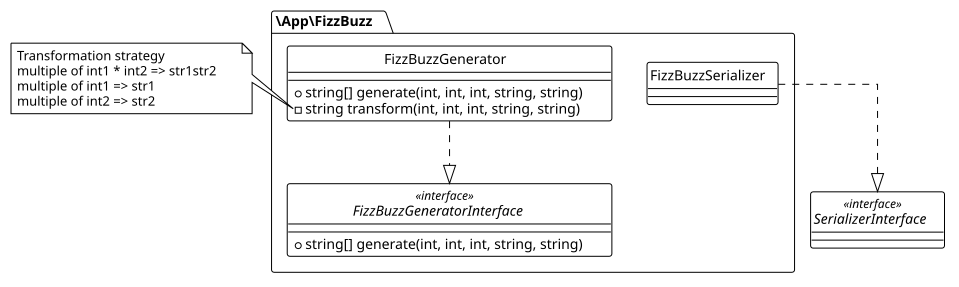
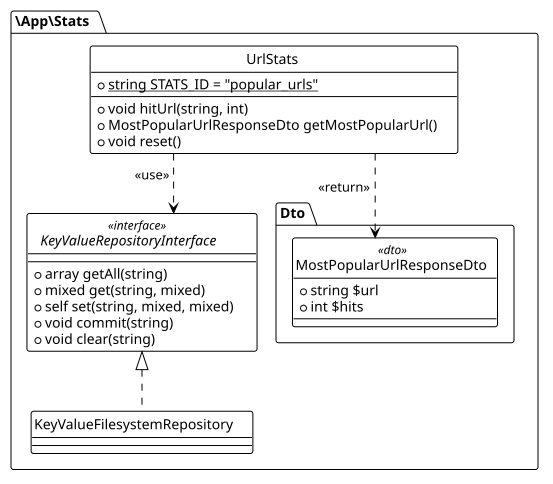

# FizzBuzz REST API

This project has the intention of solving a fizzbuzz challenge described in a take home test, which exposes the endpoint to generate a fizzbuzz list given a set of parameters.

---

## Table of Contents

- [Requirements](#requirements)
- [Setup](#setup)
- [Endpoints and usage](#endpoints-and-usage)
- [Running the Project](#running-the-project)
- [Running Tests](#running-tests)
- [Architecture](#architecture)

---

## Requirements

### Docker (recommended)

| Tool | Version |
|------|---------|
| Docker | 24 preferred |
| Docker compose plugin | Installed and enabled |

### Manual

| Tool | Version |
|------|---------|
| PHP | \>= 8.4 |
| Composer | \>= 2.x |
| Symfony CLI | \>= 5.x |

---

## Setup

Clone the repository, then, follow the instructions, either Docker or a manual installation.

```shell
git clone https://github.com/julianmejio/test-lbc.git julianmejio-lbc-fizzbuzz
cd julianmejio-lbc-fizzbuzz
```

By default, docker will expose the HTTP API on the port 8000.
To change it, copy `.env` to `.env.local`and change the port in the variable `DOCKER_HTTP_PORT`.

```shell
cp  .env .env.local
```

### Additional steps for manual installation

If you want a manual installation and run directly at host, follow these additional steps:

#### 1. Install PHP dependencies

```shell
composer install
```

#### 2. Check for Symfony requirements

```shell
symfony check:requirements
```
You should see a message:

> [OK]                                         
> Your system is ready to run Symfony projects

If a warning or error raises, it is strongly recommended to solve it before running the project.

---

## Running the Project

### Docker (recommended)

You can either run the project in both `dev` and `prod`environments:

#### Production environment

Files and installation will be already optimized for production.

```shell
docker compose -f docker-compose.yml up -d
```

#### Development environment

Please note that development can be verbose in debug scenarios, and live editing is possible, hence, the responses are slightly slower.

```shell
docker compose up -d
```

#### Stop the containers

```shell
docker compose down
```

### Manual: using the Symfony CLI (recommended)

```bash
symfony server:start
```

The app will be available at **http://localhost:8000**.

## Endpoints and usage

There are two endpoints available:
* `GET /fizzbuzz`: retrieves a list given the parameters
    * Query string parameters:
        * `int1` number whose multiples are replaced by `str1`.
        * `int2` number whose multiples are replaced by `str2`.
        * `limit` last number to be generated on the list (inclusive).
        * `str1` string that will replace the multiples of `int1`.
        * `str2` string that will replace the multiples of `int2`.
    * This endpoint supports two output formats:
        * When `Accept: application/json`: will return a list in JSON format.
        * When anything else: will return a list in CSV format.
* `GET /stats`: returns the parameters of the most frequent request and its number of hits.
    * This endpoint does not accept parameters

### Examples

```shell

# Example 1: Original fizzbuzz list up to 16
curl "http://localhost:8000/fizzbuzz?int1=3&int2=5&str1=fizz&str2=buzz&limit=16"
# 1,2,fizz,4,buzz,fizz,7,8,fizz,buzz,11,fizz,13,14,fizzbuzz,16

# Example 2: fizzbuzz list in JSON format up to 16
curl -H "Accept: application/json" "http://localhost:8000/fizzbuzz?int1=3&int2=5&str1=fizz&str2=buzz&limit=16"
# ["1","2","fizz","4","buzz","fizz","7","8","fizz","buzz","11","fizz","13","14","fizzbuzz","16"]

# Example 3: BBABBA string
curl "http://localhost:8000/fizzbuzz?int1=1&int2=2&str1=B&str2=A&limit=20"
# B,BA,B,BA,B,BA,B,BA,B,BA,B,BA,B,BA,B,BA,B,BA,B,BA

# Example 4: foo-bar 
curl "http://localhost:8000/fizzbuzz?int1=5&int2=11&str1=foo&str2=bar&limit=50"
# 1,2,3,4,foo,6,7,8,9,foo,bar,12,13,14,foo,16,17,18,19,foo,21,bar,23,24,foo,26,27,28,29,foo,31,32,bar,34,foo,36,37,38,39,foo,41,42,43,bar,foo,46,47,48,49,foo

# Example 5: Co-primes 3 and 6 (B is never shown because it overlaps with multiples of 3)
curl "http://localhost:8000/fizzbuzz?int1=3&int2=6&str1=A&str2=B&limit=50"
# 1,2,A,4,5,AB,7,8,A,10,11,AB,13,14,A,16,17,AB,19,20,A,22,23,AB,25,26,A,28,29,AB,31,32,A,34,35,AB,37,38,A,40,41,AB,43,44,A,46,47,AB,49,50

# Example 6: Same as example 5 but retrieved as JSON
curl -H "Accept: application/json" "http://localhost:8000/fizzbuzz?int1=3&int2=6&str1=A&str2=B&limit=50"
# ["1","2","A","4","5","AB","7","8","A","10","11","AB","13","14","A","16","17","AB","19","20","A","22","23","AB","25","26","A","28","29","AB","31","32","A","34","35","AB","37","38","A","40","41","AB","43","44","A","46","47","AB","49","50"]

```

---

## Running Tests

Use a manual installation to run the test suite

```bash
# With coverage report (requires Xdebug or PCOV)
php bin/phpunit tests
```

---

## Architecture

Below, find the two main modules of the API: FizzBuzz list generator and Stats.

### FizzBuzz module

This module is responsible for generating a fizzbuzz list, and running the transformation rules:



Fizz Buzz lists are generated by the built-in generator `\App\FizzBuzz\FizzBuzzGenerator`.

Fizz Buzz lists transform specific items following some arithmetic rules. For simple cases like adding or removing existent rules, the method `\App\FizzBuzz\FizzBuzzGenerator::transform()` can be modified.

For more complex or custom generators, a new generator implementation can  be created by implementing the interface `\App\FizzBuzz\FizzBuzzGeneratorInterface`.

There is a `FizzBuzzSerializer` that supports CSV and JSON transformations for API responses.

> JSON is used when the request header `Accept: application/json`. Any other `Accept` value will return a CSV list.

### Stats module

This module handles the stats data, and its support (currently file system but extensible to other means).



`\App\Stats\UrlStats` is the stats service that counts the URL hits.

The URL stats records the endpoint plus the query string, and the accumulated number of hits.

There is a built-in filesystem-based key-value store, which allows to store the data structure required for the URL stats.
This filesystem creates a json file in `%kernel.cache_dir%/{$storeId}`, where the stats are stored.

> The built-in filesystem store is intentionally lightweight. For high-traffic scenarios where race conditions become a concern, a more robust repository can be plugged in by implementing \App\Stats\KeyValueRepositoryInterface.

### Note

This project is a solution to the following challenge:

___
*Please share a Git repository containing your solution, including any setup
instructions required to run and evaluate it.*

The original fizz-buzz consists in writing all numbers from 1 to 100, and just
replacing all multiples of 3 by "fizz", all multiples of 5 by "buzz", and all
multiples of 15 by "fizzbuzz".
The output would look like this:
"1,2,fizz,4,buzz,fizz,7,8,fizz,buzz,11,fizz,13,14,fizzbuzz,16,...".

Your goal is to implement a web server that will expose a REST API endpoint that:
- Accepts five parameters: three integers int1, int2 and limit, and two strings
  str1 and str2.
- Returns a list of strings with numbers from 1 to limit, where: all multiples
  of int1 are replaced by str1, all multiples of int2 are replaced by str2, all
  multiples of int1 and int2 are replaced by str1str2.

The server needs to be:
- Ready for production
- Easy to maintain by other developers

Bonus: add a statistics endpoint allowing users to know what the most frequent
request has been.

This endpoint should:
- Accept no parameter
- Return the parameters corresponding to the most used request, as well as the
  number of hits for this request
